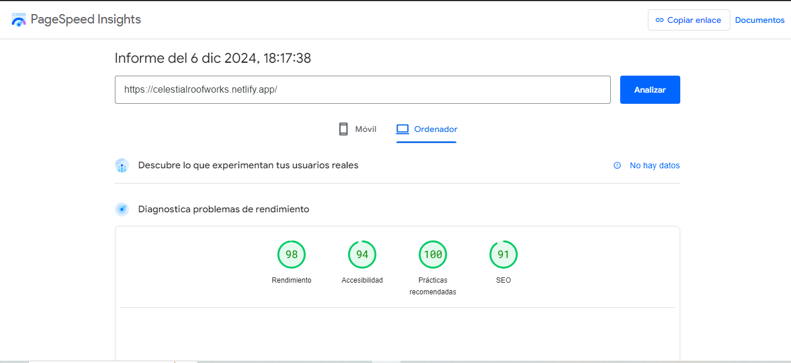

# Celestia Roofworks 🌟

## 📖 Descripción del Proyecto

**Celestia Roofworks** es una página web diseñada para una empresa que ofrece soluciones premium de techado. Con un enfoque en la estética, funcionalidad y sostenibilidad, este proyecto incluye secciones de servicios, proyectos, contacto y más. Está construido utilizando tecnologías modernas como **Astro** y **React** para ofrecer un rendimiento optimizado y una experiencia interactiva fluida.

---

## 🚀 Instrucciones para Visualizar el Proyecto

### **1. Requisitos Previos**

Antes de empezar, asegúrate de tener instalados los siguientes programas:

- **Node.js** (versión 16 o superior): [Descargar Node.js](https://nodejs.org/)
- **Git**: [Descargar Git](https://git-scm.com/)

### **2. Clonar el Repositorio**

Clona este repositorio a tu máquina local con el siguiente comando:

```bash
git clone https://github.com/RodriguezKevin8/CelestiaRoofworks.git
```

### **3. Clonar el Repositorio**

Accede al directorio del proyecto e instala las dependencias necesarias usando npm:

```
cd CelestiaRoofworks
npm install

```

### **4. Ejecutar el Proyecto en Desarrollo**

Inicia el servidor de desarrollo para visualizar el proyecto localmente

```
npm run dev
```

Luego, abre tu navegador y navega a: http://localhost:4321

### **4.1 🖥️ Previsualización del Sitio**

Puedes previsualizar el sitio web en el siguiente enlace:
https://celestialroofworks.netlify.app/

### **5. Cómo Detener el Proyecto**

Para detener el servidor de desarrollo, presiona Ctrl + C en la terminal donde se está ejecutando el comando npm run dev.

### **6. 🎨 Enfoque de Diseño y Tecnologías Utilizadas**

### **Enfoque de Diseño**

El diseño del proyecto se centra en:

- **Responsividad:** Garantiza que la página funcione en dispositivos móviles, tabletas y computadoras de escritorio.
- **Estética moderna:** Usa fuentes personalizadas, transiciones suaves y un esquema de colores profesional.
- **Interactividad:** Animaciones suaves y efectos al desplazarse por la página.

### **Tecnologías Utilizadas**

- **Astro:** Framework para sitios web estáticos y rápidos, ideal para optimizar el rendimiento y SEO.
- **React:** Implementado en componentes interactivos como el formulario de contacto y la barra de navegación.
- **Tailwind CSS:** Framework de diseño CSS para estilos rápidos, configurables y responsivos.
- **Tailwind CSS Animated:** Extensión de Tailwind para agregar animaciones suaves y modernas en la página.
- **Google Maps Embed API:** Integración para mostrar mapas interactivos y personalizados.
- **Cloudflare R2:** Usado para el almacenamiento y distribución eficiente de recursos multimedia, como imágenes y videos.
- **Web.dev:** Herramienta utilizada para evaluar el rendimiento, accesibilidad y mejores prácticas del sitio.
- **Squoosh:** Utilizado para la optimización avanzada de imágenes, reduciendo su tamaño sin comprometer la calidad.

Estas tecnologías y herramientas aseguran que **Celestia Roofworks** sea eficiente, estéticamente agradable y accesible para todos los usuarios.

### **7. 📂 Estructura del Proyecto**

```
/celestia-roofworks
├── /src
│   ├── /assets
│   ├── /components
│   ├── /elements
│   ├── /layouts
│   └── /pages
└── package.json

```

### 🏎️ Pruebas de Rendimiento


